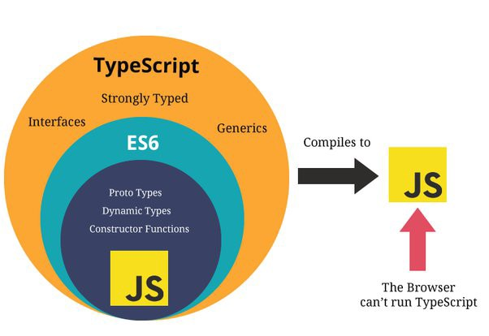

<h1 align="center">Introducción a TypeScript</h1>

Typescript se define como un **superset** de JavaScript. Se le domina superset porque Typescript está construido por encima de Javascript. Typescript proporciona características extras como el **tipado**,**interfaces**, **decoradores** y otras funcionalidades que nos ayudarán en el día a día para trabajar con la **programación orientada a objetos** y la **reducción de errores**.

<br>

<p align="center">

</p>

<br>

## Tipado

Typescript posee anotaciones de tipado tanto en variables como en funciones. Estas anotaciones nos ayudarán a definir reglas de tipo y restricciones.

```typescript

    const userName: string = "Elon musk";
    const numbers: number[] = [1, 2, 3, 4, 5];
    const isTall: boolean = true;

    function greetings(name: string): void {
        console.log(`Hello ${name}`);
    }
```

## Interfaces

Las interfaces en Typescript cumplen la función de definir contratos dentro del código. Las interfaces moldean definiciones que una clase debe cumplir, destacando que estas reglas aplican tanto en métodos como en propiedades.

```typescript

    interface UserContract {
        name: string;
        phone: number;
        greetings(): string;
        goodBye(): string;
    }
    class User implements UserContract {
        ... // implements todo
    }
```

## Conceptos clave de TypeScript
A continuación algunos conceptos clave para comprender los artefactos de Typescript:

### Compilador de TypeScript:
El compilador de TypeScript viene incorporado en la instalación, el compilador básicamente se encarga de transformar el código TypeScript en código JavaScript.

### Archivo tsconfig.json:
Es un archivo de configuración que utiliza el compilador para ser ejecutado bajo ciertas condiciones. La presencia de un archivo tsconfig.json en un directorio indica que el directorio es la raíz de un proyecto de TypeScript.

### Módulos de TypeScript:
A partir de ECMAScript 2015, JavaScript tiene el concepto de módulos. TypeScript comparte este mismo concepto, utilizando la misma sintaxis para exportar e importar módulos externos.
